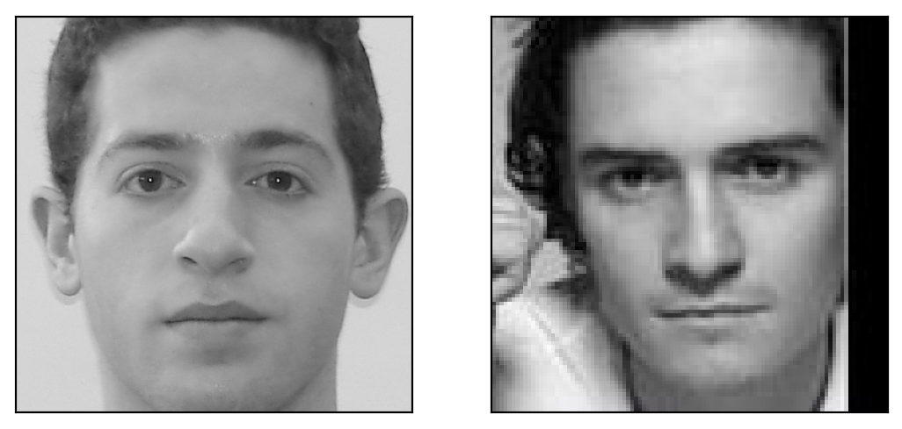

# 442 Course Project - Celebrity Face Matcher

This project implements the Haar Feature Cascade face detection system described
in the Viola-Jones reserach paper. It then combines face detection with auto-cropping
and then feeds the results into a Keras neural network that outputs the celebrity
face from a dataset most similar to the input image.

Example Output:


## Dependencies

You may need to use pip/conda/your preferred method to install these dependencies:

1. skimage
2. cv2
3. dask
4. pickle
5. sklearn
6. keras
7. keras-vggface
8. imutils

## Usage

1. running interactive web server
```
cd path/to/face_matcher/scratch_impl
python3 user_interface.py
```

2. running from command line
```
cd path/to/face_matcher/scratch_impl
python3 main.py path/to/image
```

3. running tests
```
cd path/to/face_matcher/scratch_impl
python3 tests/test_to_run.py
```

## Authors:
* Alec Goldberg (alechg@umich.edu)
* Maria Koubenski (mkoub@umich.edu)
* Peter Tolsma (pejato@umich.edu)
* Ben Turner (bentur@umich.edu)


